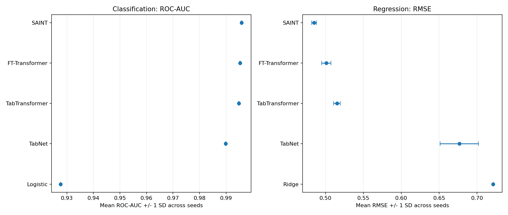

# Comparación de Deep Learning Tabular

Comparación reproducible de TabNet, TabTransformer, FT-Transformer y una
variante supervisada e inductiva de SAINT. El proyecto estudia clasificación y
regresión con un protocolo común, un baseline lineal por tarea y separación
estricta entre entrenamiento, validación y prueba.

## Experimentos

| Tarea | Dataset | Objetivo | Métrica principal |
|---|---|---|---|
| Clasificación | Airlines Passenger Satisfaction | `satisfaction` | ROC-AUC |
| Regresión | California Housing | `MedHouseVal` | RMSE |

Cada tarea utiliza tres semillas (`42`, `123`, `2025`). Las semillas comparten
el mismo split para medir sensibilidad a inicialización y minibatches.

## Resultados

Media y desviación estándar sobre las tres semillas:

| Modelo | Airlines ROC-AUC ↑ | California RMSE ↓ |
|---|---:|---:|
| Baseline lineal | 0.927669 ± 0.000000 | 0.721258 ± 0.000000 |
| TabNet | 0.989872 ± 0.000184 | 0.676694 ± 0.025412 |
| TabTransformer | 0.994777 ± 0.000152 | 0.515159 ± 0.004412 |
| FT-Transformer | 0.995298 ± 0.000092 | 0.501123 ± 0.006163 |
| SAINT inductivo | **0.995818 ± 0.000185** | **0.485111 ± 0.003245** |

ROC-AUC y RMSE pertenecen a problemas distintos y no se comparan entre sí.
Los resultados describen estas configuraciones y no establecen una superioridad
universal de una arquitectura.



## Estructura

```text
.
├── 01_classification.ipynb
├── 02_regression.ipynb
├── 03_comparison.ipynb
├── src/
│   ├── data.py
│   ├── models.py
│   ├── training.py
│   └── evaluation.py
└── results/
    ├── classification/metrics/summary_metrics.csv
    ├── regression/metrics/summary_metrics.csv
    └── figures/
```

Los datasets, checkpoints, historiales y predicciones permanecen locales y no
se versionan.

## Instalación

Entorno probado: Python `3.14.3`, PyTorch `2.13.0+cu130` y CUDA `13.0`.

```bash
python -m venv .venv
```

Activa el entorno con uno de los siguientes comandos:

```powershell
# Windows PowerShell
.\.venv\Scripts\Activate.ps1
```

```bash
# Linux o macOS
source .venv/bin/activate
```

Instala las dependencias:

```bash
python -m pip install --upgrade pip
python -m pip install -r requirements.txt
```

La configuración `device="auto"` utiliza CUDA cuando está disponible y cambia
a CPU en caso contrario. Para otra versión de CUDA puede ser necesario instalar
la distribución de PyTorch correspondiente antes de instalar los requisitos.

## Datos

1. Descarga [Airline Passenger Satisfaction](https://www.kaggle.com/datasets/teejmahal20/airline-passenger-satisfaction).
2. Coloca `train.csv` y `test.csv` dentro de `archive/`.
3. California Housing se obtiene automáticamente mediante
   [`fetch_california_housing`](https://scikit-learn.org/stable/modules/generated/sklearn.datasets.fetch_california_housing.html)
   y se almacena en la misma carpeta local.

## Ejecución

Abre el proyecto desde su directorio raíz y ejecuta los notebooks en orden:

1. `01_classification.ipynb`
2. `02_regression.ipynb`
3. `03_comparison.ipynb`

Los dos primeros notebooks entrenan y persisten los modelos. El tercero no
entrena: audita los artefactos, recalcula métricas y construye la comparación.
La copia incluida de `03_comparison.ipynb` conserva sus resultados para poder
consultarlos directamente en GitHub.

## Protocolo

- Preprocesamiento ajustado exclusivamente con entrenamiento.
- Splits compartidos por todos los modelos dentro de cada tarea.
- Early stopping y selección de checkpoints basados en validación.
- Test aislado hasta la evaluación final.
- Probabilidades, predicciones y checkpoints verificados al persistir.
- Inferencia independiente por fila para todas las arquitecturas comparadas.

## Limitaciones

- Tres semillas no estiman incertidumbre poblacional completa.
- Airlines contiene valoraciones posteriores a la experiencia de vuelo.
- California Housing usa un split aleatorio pese a su estructura espacial.
- SAINT se evalúa sin atención entre filas para mantener inferencia inductiva.
- No se realizó una búsqueda exhaustiva de hiperparámetros.

## Licencia

El código se distribuye bajo la [licencia MIT](LICENSE). Los datasets conservan
sus términos de uso originales y no forman parte de este repositorio.
